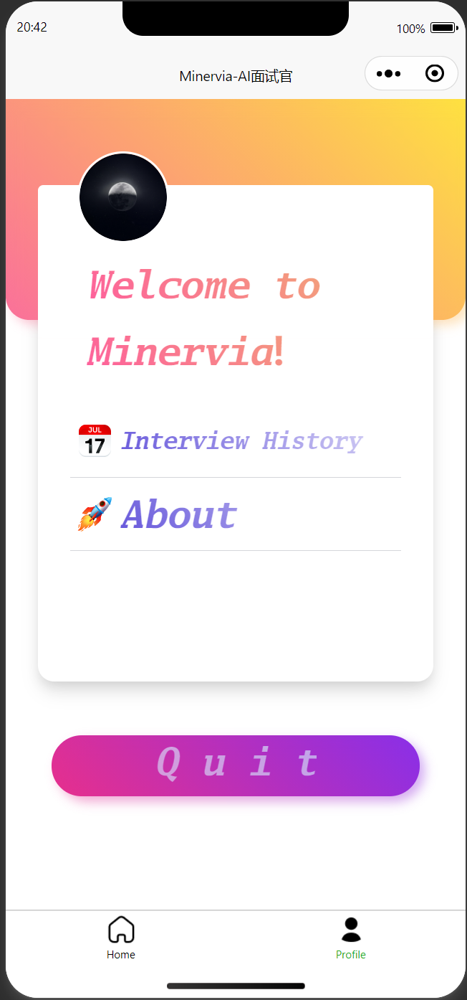

halo 这里是Minervia，一个AI面试小程序。

这是一个练手的项目，锻炼将业务和AI融合的能力

背景是AI正在逐渐融入我们的生活

# Minervia - AI Interview Assistant

Minervia is an AI-powered interview assistant designed to combine AI and interviews and provide an interview exprience different from the past. This project serves as a hands-on learning experience where I focus on developing the core business code and combining it with AI technology to create a functional and efficient interview assistant.

## Background

AI is increasingly becoming an integral part of our daily lives, and I believe it's the right time to experiment with AI in my own projects. Minervia is an attempt to blend AI technology with real-world business processes, specifically in the recruitment industry. By building this project, I aim to explore how AI can enhance the efficiency and effectiveness of the interview process.

## Technologies Used

- **Frontend**: Vue.js, Element UI，Uniapp
- **Backend**: SpringBoot,  RuoYi-CLI

## Preview

### 小程序页面：

           

### 后台页面：

### 

